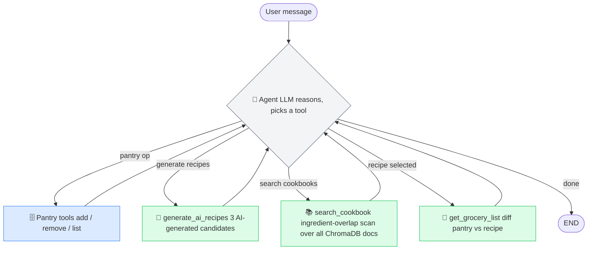

# Recipe Agent — ReAct with LangGraph

A conversational recipe assistant built on the **ReAct** (Reason + Act) pattern using LangGraph. The agent reasons about what to do next and picks from a set of tools — no hardwired routing logic.

## Architecture



**One thread per REPL session** — conversation history is preserved across turns via `MemorySaver`. The pantry persists in `pantry.json` independently of graph state.

## ReAct patterns demonstrated

| Pattern | Where |
|---|---|
| **ReAct loop** | `create_react_agent` — LLM reasons + picks tool each turn |
| **No routing logic** | LLM decides which tool to call based on user intent |
| **Typed tool parameters** | `list[str]`, `list[dict]`, `Optional[...]` — no JSON string workarounds |
| **Persistent external state** | `pantry.json` read/written directly by tools, outside graph state |
| **Session memory** | `MemorySaver` + single `thread_id` per REPL session |
| **Ingredient-overlap search** | Full collection scan in ChromaDB, ranked by pantry match count |
| **Observability** | LangSmith + Langfuse tracing via callbacks |

## Tools

| Tool | Description |
|---|---|
| `get_pantry` | Load pantry as flat list |
| `list_pantry_by_category` | Show pantry grouped by category |
| `add_to_pantry` | Add ingredients (typed list of dicts) |
| `remove_from_pantry` | Remove ingredients by exact name |
| `generate_ai_recipes` | Generate 3 recipes from pantry + constraints |
| `search_cookbook` | Full ingredient-overlap scan over ChromaDB cookbook collection |
| `get_grocery_list` | Diff pantry against a recipe's required ingredients |

## File structure

```
recipe_agent/
├── tools.py          # All @tool functions
├── graph.py          # create_react_agent + system prompt
├── run.py            # Interactive REPL
├── pantry.py         # Pantry CRUD — reads/writes pantry.json
├── rag.py            # ChromaDB client + ingredient-overlap search
├── ingest.py         # Ingest recipe PDFs into ChromaDB
├── pantry.json       # Auto-created on first add (gitignore this)
└── recipe_books/     # PDF recipe books for ingest
```

## Setup

```bash
uv sync
cp .env.example .env  # add your API keys
uv run python run.py
```

**.env keys:**
```
OPENAI_API_KEY=sk-...

# Optional — LangSmith tracing
LANGCHAIN_TRACING_V2=true
LANGCHAIN_API_KEY=ls__...
LANGCHAIN_PROJECT=recipe-agent

# Optional — Langfuse tracing
LANGFUSE_PUBLIC_KEY=pk-lf-...
LANGFUSE_SECRET_KEY=sk-lf-...
LANGFUSE_HOST=https://cloud.langfuse.com
```

## Ingest recipe books

Drop PDF files into `recipe_books/` and run:

```bash
uv run python ingest.py
```

## Example session

```
You> füge Hähnchen, Reis, Brokkoli, Sojasoße, Knoblauch hinzu
🤖 Zur Speisekammer hinzugefügt: chicken, rice, broccoli, soy sauce, garlic. Du hast jetzt 5 Artikel.

You> zeige Speisekammer
🤖 Deine Speisekammer:
   Protein: chicken (some)
   Vegetable: broccoli (some), garlic (some)
   Grain: rice (some)
   Condiment: soy sauce (some)

You> koch mir was Asiatisches für 2
🤖 Hier sind deine Optionen:
   1. Chicken Fried Rice — gebratener Reis mit Hähnchen und Gemüse (25 Min., einfach)
   2. Knoblauch-Hähnchen Stir-Fry — schnelles Wok-Gericht (20 Min., einfach)
   3. Hähnchen-Reissuppe — wärmende Suppe mit Knoblauch (30 Min., einfach)

You> 1
🤖 Du hast alles — kein Einkaufen nötig.
🤖 ## Chicken Fried Rice
   ...

You> suche Rezepte in meinen Büchern mit Kichererbsen
🤖 Hier sind die passendsten Rezepte aus deinen Kochbüchern:
   1. Confit tandoori chickpeas — ottolenghi_simple.pdf
   2. Gigli with chickpeas and za'atar — ottolenghi_simple.pdf
   ...

You> 2
🤖 Einkaufsliste für Gigli with chickpeas and za'atar:
   - anchovy fillets
   - lemon
   ...
```

## Verbose mode

```bash
uv run python run.py --verbose
```

Shows each tool call and its arguments as the agent reasons through the request.

## Swapping LLMs

In [tools.py](tools.py) and [graph.py](graph.py), change the `llm` line:

```python
# Anthropic Claude
from langchain_anthropic import ChatAnthropic
llm = ChatAnthropic(model="claude-sonnet-4-6")

# Ollama (local, free)
from langchain_ollama import ChatOllama
llm = ChatOllama(model="llama3.1")
```

## Key design decisions

**Pantry outside graph state** — the pantry lives in `pantry.json`, not in LangGraph's checkpointer. Tools read/write it directly. This means pantry data persists across all sessions, is easy to manually edit, and the graph state stays clean (just messages).

**search_cookbook uses ingredient-overlap, not vector search** — `get_recipes_by_ingredient_overlap` scans every document in the ChromaDB collection and ranks by how many pantry items appear in each recipe's ingredient list. This guarantees no recipe is missed. Vector search is only used as a fallback when the pantry is empty.

**Single thread per session** — unlike the previous DAG version (new thread per message), the ReAct agent uses one `thread_id` per REPL session. This lets the LLM carry context across turns (e.g., dietary preferences mentioned earlier are remembered).
