# Recipe Agent — LangGraph with Persistent Pantry

## Architecture

```mermaid
flowchart TD
    START([START]) --> load_pantry

    load_pantry["📦 load_pantry\nreads pantry.json"] --> classify_intent

    classify_intent{"🧠 classify_intent\nLLM intent routing"}
    classify_intent -->|recipe / recipe_db| parse_input
    classify_intent -->|pantry_add| pantry_add
    classify_intent -->|pantry_remove| pantry_remove
    classify_intent -->|pantry_list| pantry_list

    pantry_add["➕ pantry_add\nadd to pantry.json"] --> END([END])
    pantry_remove["➖ pantry_remove\nremove from pantry.json"] --> END
    pantry_list["📋 pantry_list\nshow grouped contents"] --> END

    parse_input["🔍 parse_input\nextract constraints,\nextras & preferences"]
    parse_input -->|needs_clarification| END
    parse_input -->|intent = recipe| generate_recipes
    parse_input -->|intent = recipe_db| search_db_recipes

    generate_recipes["🍳 generate_recipes\n3 AI-generated candidates"]
    search_db_recipes["📚 search_db_recipes\nsearch ChromaDB"]

    generate_recipes -->|no candidates| END
    search_db_recipes -->|no candidates| END
    generate_recipes -->|has candidates| INTERRUPT
    search_db_recipes -->|has candidates| INTERRUPT

    INTERRUPT[/"⏸ INTERRUPT\nuser selects recipe"/]
    INTERRUPT --> handle_selection

    handle_selection{"✋ handle_selection\nprocess user input"}
    handle_selection -->|"non-recipe input\n(restart_flow)"| load_pantry
    handle_selection -->|"mehr / iteration < 3"| generate_recipes
    handle_selection -->|approved| generate_grocery_list

    generate_grocery_list["🛒 generate_grocery_list\ndiff pantry vs needs"] --> format_output
    format_output["📄 format_output\nfull recipe instructions"] --> END

    style pantry_add fill:#dbeafe,stroke:#3b82f6
    style pantry_remove fill:#dbeafe,stroke:#3b82f6
    style pantry_list fill:#dbeafe,stroke:#3b82f6
    style generate_recipes fill:#dcfce7,stroke:#22c55e
    style search_db_recipes fill:#dcfce7,stroke:#22c55e
    style generate_grocery_list fill:#dcfce7,stroke:#22c55e
    style format_output fill:#dcfce7,stroke:#22c55e
    style INTERRUPT fill:#fef9c3,stroke:#eab308
    style load_pantry fill:#f3f4f6,stroke:#6b7280
    style classify_intent fill:#f3f4f6,stroke:#6b7280
    style parse_input fill:#f3f4f6,stroke:#6b7280
    style handle_selection fill:#f3f4f6,stroke:#6b7280
```



## LangGraph patterns demonstrated

| Pattern | Where |
|---|---|
| **Intent-based routing** | `classify_intent` → conditional edges to 5 branches |
| **Persistent external state** | `pantry.json` loaded/saved outside graph state |
| **Conditional edges** | `route_by_intent`, `route_after_parse`, `route_after_selection` |
| **Human-in-the-loop** | `interrupt_before=["handle_selection"]` |
| **Loop with cap** | `iteration_count < 3` on recipe regeneration |
| **Mid-flow restart** | `handle_selection` → `load_pantry` when non-recipe input detected |
| **RAG path** | `search_db_recipes` queries ChromaDB for cookbook recipes |
| **Checkpointing** | `MemorySaver` for state across interrupts |

## File structure

```
recipe_agent/
├── state.py          # TypedDict state schema
├── pantry.py         # Pantry CRUD — reads/writes pantry.json
├── nodes.py          # All node functions (LLM calls + pantry ops)
├── graph.py          # Graph wiring, edges, interrupt config
├── run.py            # Interactive REPL
├── requirements.txt
└── pantry.json       # Auto-created on first add (gitignore this)
```

## Setup

```bash
pip install -r requirements.txt
export OPENAI_API_KEY=sk-...
python run.py
```

## Example session

```
You> add chicken breast, rice, broccoli, soy sauce, garlic, eggs, onion, olive oil
🤖 Added to pantry: chicken breast, rice, broccoli, soy sauce, garlic, eggs, onion, olive oil. You now have 8 items.

You> show pantry
🤖 Your pantry:
   Protein: chicken breast (some)
   Vegetable: broccoli (some), garlic (some), onion (some)
   Grain: rice (some)
   Condiment: soy sauce (some), olive oil (some)
   Dairy: eggs (some)

You> quick asian dinner for 2
🤖 Using your pantry (8 items). Generating recipes...
🤖 Here are your options:
   1. Chicken Fried Rice — ...
   2. Garlic Chicken Stir-Fry — ...
   3. Egg Drop Soup with Rice — ...

You> 1
🤖 Going with: Chicken Fried Rice
🤖 You have everything you need — no shopping required.
🤖 ## Chicken Fried Rice ...
```

## Swapping LLMs

In `nodes.py`, change the `llm` line:

```python
# Anthropic
from langchain_anthropic import ChatAnthropic
llm = ChatAnthropic(model="claude-sonnet-4-20250514")

# Ollama (local, free)
from langchain_ollama import ChatOllama
llm = ChatOllama(model="llama3.1")
```

## Key design decision: pantry outside graph state

The pantry lives in a JSON file, not in LangGraph's checkpointer. Why:
- Pantry persists across all sessions (graph threads are per-conversation)
- Simple to manually edit, backup, or sync
- Graph state stays focused on the current request

If you later want multi-user support or more complex querying, swap `pantry.py` for SQLite — the interface stays the same.
